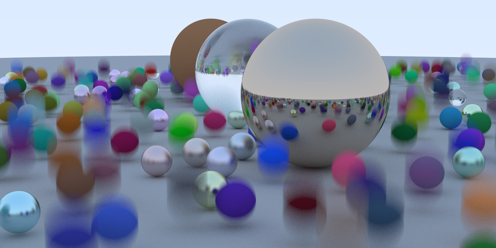
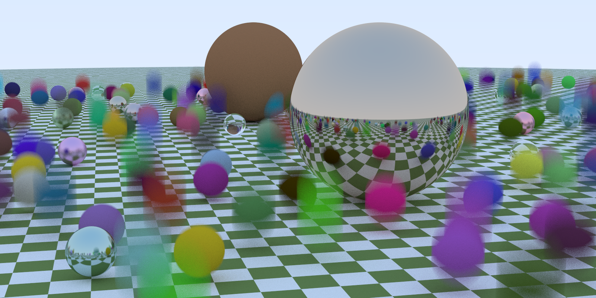
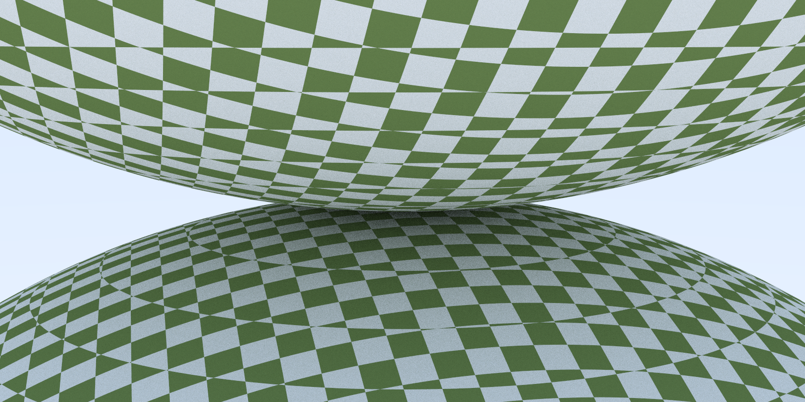

# RayTracingRs
使用rust实现的软光线追踪
### 使用方法
```bash
//编译执行版本
cargo build --release 

//执行程序，结果为image.ppm文件
./target/release/ray_tracing_rs.exe > image.ppm 
```
### 效果展示
#### 运动模糊

#### BVH效果
相同设置下，同时启动两个程序(有无BVH)
- 有BVH的执行时间为: 401.0845981s
- 无BVH的执行时间为: 1286.6015396s
#### 纹理效果
##### 在棋盘格上的球体们

##### 双棋盘格球体
