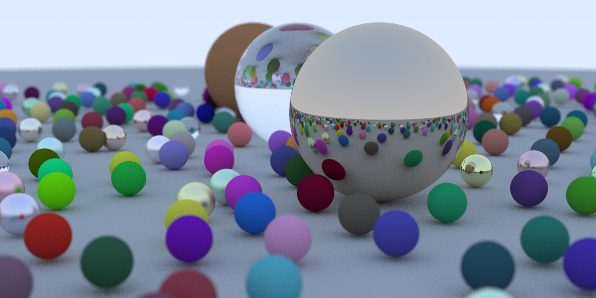

# RayTracingRs
使用rust实现的软光线追踪
### 分支介绍
- **book1**分支  实现了**Ray Tracing in One Weekend**书中的基本内容

### 效果展示
##### book1分支最终效果

### 参考文档
[Ray Tracing in One Weekend](https://raytracing.github.io/books/RayTracingInOneWeekend.html)

[Ray Tracing in One Weekend V3.0中文翻译](https://zhuanlan.zhihu.com/p/128582904)

[Rust Ray Tracing in One Weekend - Rust一周末光线追踪](https://zhuanlan.zhihu.com/p/659982592)

[Rust语言圣经(Rust Course)](https://course.rs/about-book.html)