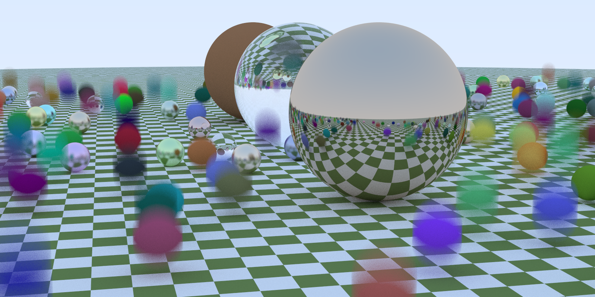

# RayTracingRs
使用rust实现的软光线追踪
### 使用方法
```bash
//编译执行版本
cargo build --release 

//执行程序，结果为image.ppm文件
./target/release/ray_tracing_rs.exe > image.ppm 
```
### 效果展示
#### 运动模糊

#### BVH效果
相同设置下，同时启动两个程序(有无BVH)
- 有BVH的执行时间为: 401.0845981s
- 无BVH的执行时间为: 1286.6015396s
#### 纹理效果
##### 在棋盘格上的球体们

##### 双棋盘格球体

##### 大理石材质

#### 贴图效果

#### Cornell_Box与烟雾

#### 最终场景


### 参考文档
[Ray Tracing: The Next Week](https://raytracing.github.io/books/RayTracingTheNextWeek.html)

[Ray Tracing: The Next Week V3.0中文翻译（上）](https://zhuanlan.zhihu.com/p/129372723#:~:text=%E6%9C%AC%E4%B9%A6%E4%B8%BAPeterShirley%E7%9A%84Ray%20tracing%E5%85%A5%E9%97%A8%E6%95%99%E5%AD%A6%E7%B3%BB%E5%88%97%E7%9A%84%E7%AC%AC%E4%BA%8C%E6%9C%AC%E3%80%82%E5%BD%93%E5%89%8D%E7%89%88%E6%9C%ACv3.0%E3%80%82%E6%9C%AC%E4%B9%A6%E5%9C%A8%E7%AC%AC%E4%B8%80%E6%9C%AC%E7%9A%84%E5%9F%BA%E7%A1%80%E4%B8%8A%E5%8A%A0%E5%85%A5%E4%BA%86%E4%B8%80%E4%BA%9B%E6%96%B0%E7%9A%84%E7%89%B9%E6%80%A7,)

[Ray Tracing: The Next Week V3.0中文翻译（下）](https://zhuanlan.zhihu.com/p/129745508)
